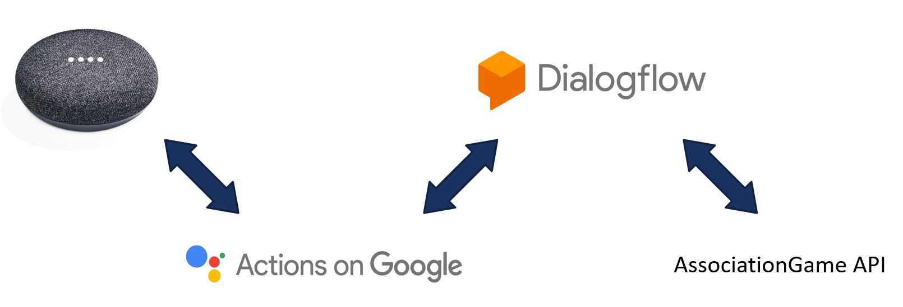
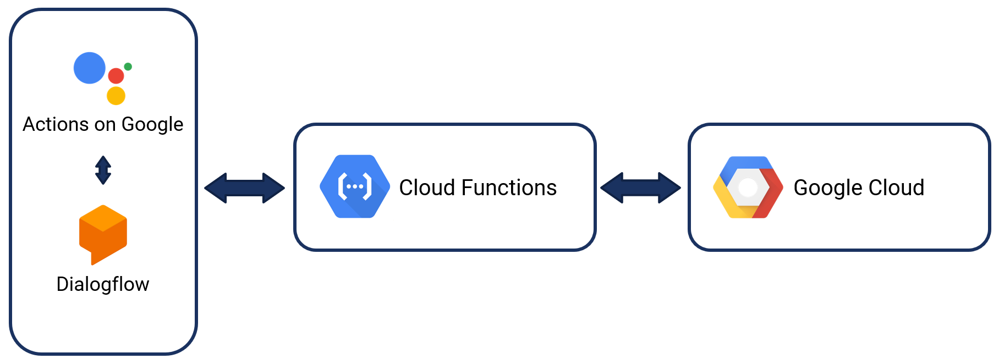
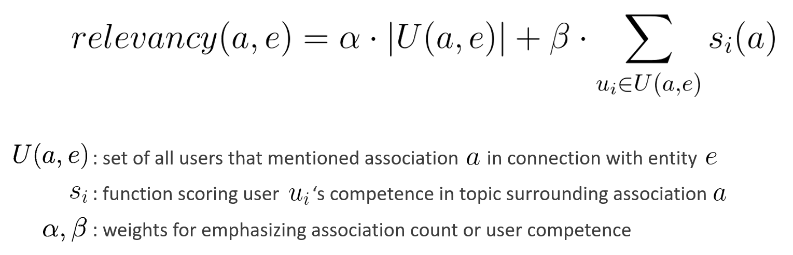
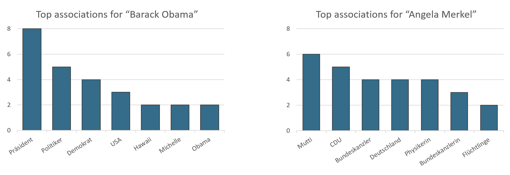
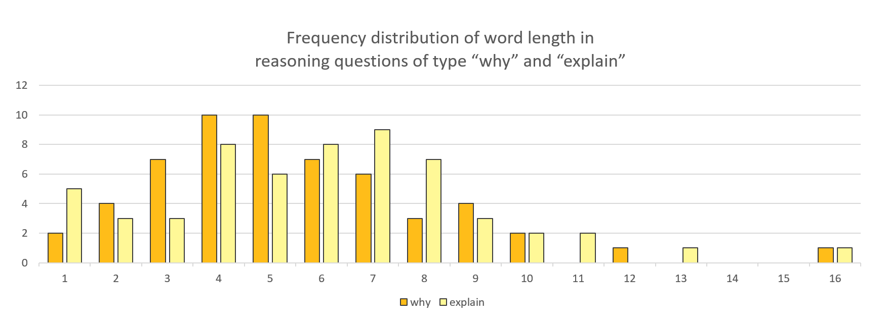

# association-game
An experimental semantic web application built on the Actions on Google/Dialogflow platform using gamification principles.


### Source code

Essential:

* `Dialogflow/`
  * import `AssocationGame.zip` into [Dialoglow](https://dialogflow.com)
* `dfwebhook/`
  * deploy Dialogflow webhook
* `gameapi/`
  * run main game API


Other:

* `preprocessing/`
  * used to gather data from DBpedia
* `postprocessing/`
  * generates statistics
* `data/`
  * contains game data ("facts") and game logs


Starting AssociationGame API:

```
cd association-game/
PYTHONPATH=. python gameapi/app.py &
```

It may be necessary to use `nohup` to keep Flask running even after logging off.


### Architecture and Deployment

This was the basic architecture:

<p align="center"></p>

The game was deployed using Google Cloud and Cloud Functions

<p align="center"></p>


### Analysis and User Study

One of the main reasons this project was created was to experiment with user-provided word associations. The following relevancy formular was used to determine relevant associations for a topic:

<p align="center"></p>

An excerpt of some the of user study findings:




